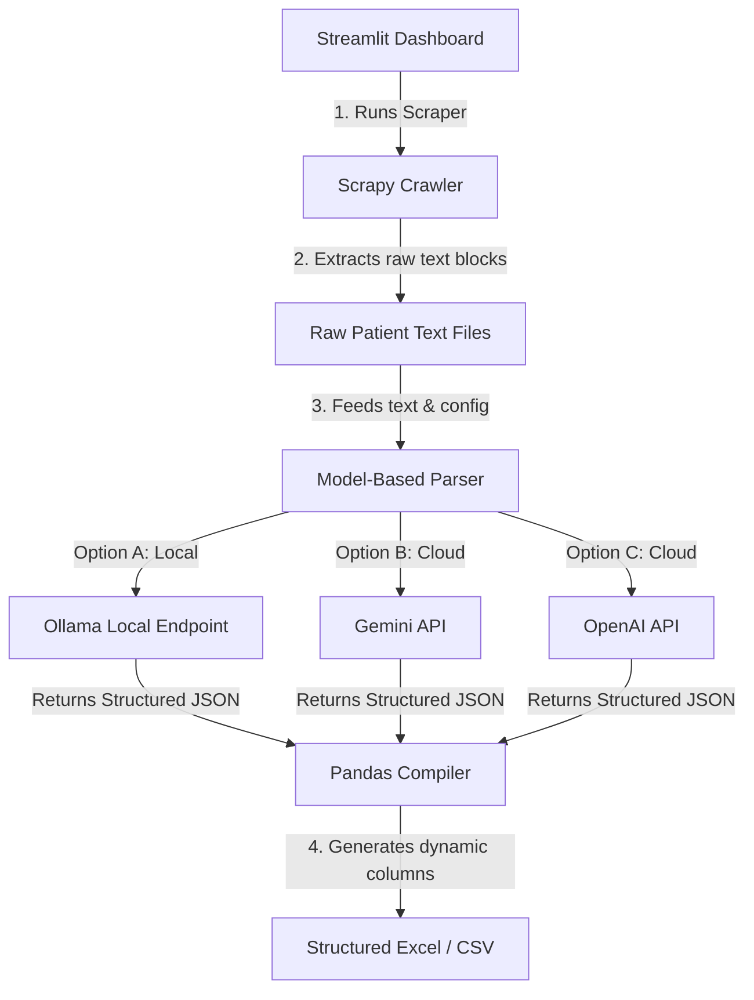

# Implementation Plan: Model-Based Relationship Extraction Scraper

We will update the parsing engine to use Large Language Models (LLMs) instead of string matching. The model will analyze the unstructured patient text, perform Named Entity Recognition (NER) and relation extraction, and output a structured JSON schema containing both standard and discovered dynamic fields.

---

## Technical Architecture

### 1. LLM Parsing Strategy
We will prompt the selected LLM to act as a structured extraction agent.
- **System Prompt**: Instructions to identify and extract patient details. It will enforce returning a strict JSON structure containing the core fields: `Patient Name`, `Mobile Number`, `Email ID`, `Disease`, `Hospitalized Duration`, `Cure Status`, `Medicine`, `Previous Record`, `Fees`.
- **Dynamic Relation Discovery**: The model is instructed to capture any other key-value relationships it finds in the text as extra fields (e.g., `Blood group`, `Diet plan`, `Allergy warnings`).
- **Structured JSON Output**: Enable JSON mode or schema constraints in the API requests so the models guarantee structured, parseable outputs.

### 2. Streamlit Dashboard Integration
We will add a "Model Settings" section in the Streamlit sidebar allowing the user to select and configure their extraction model:
1. **Local Ollama** (No API Key needed, runs locally on ports like `11434` using models like `qwen`, `llama3`, etc.)
2. **Gemini API** (Requires Gemini API key, uses `gemini-1.5-flash` or `gemini-2.0-flash`)
3. **OpenAI API** (Requires OpenAI API key, uses `gpt-4o-mini` or `gpt-4o`)
4. **Local Heuristic / Rule-based Parser** (Runs instantly offline without requiring an LLM or API keys, as a fallback)

---

## Proposed Changes

### 1. [MODIFY] [app.py](file:///c:/Users/MONISH/Proj/kathirs_llm/app.py)
Update UI to add LLM provider settings, API key text fields, model name inputs, and integrate the dynamic model parser into the post-scraping data compiler.

### 2. [MODIFY] [dynamic_parser.py](file:///c:/Users/MONISH/Proj/kathirs_llm/dynamic_parser.py)
Refactor to include calls to:
- **Ollama**: via raw HTTP requests (`httpx` or `requests` to `/api/generate` with `format="json"`).
- **Gemini**: via `google-generativeai` or HTTP requests to Gemini's endpoint.
- **OpenAI**: via the `openai` Python SDK or raw HTTP calls.
All of these will take the unstructured text and return a structured python dictionary of extracted attributes.

---

## Verification Plan

### Automated Tests
- Run validation queries against Ollama, Gemini, and OpenAI mock endpoints to ensure the parser handles connection timeouts and parses JSON outputs.
- Test fallback behavior if the LLM connection fails.

### Manual Verification
- Launch Streamlit, input credentials, select the LLM provider, enter the configuration, and start the scraper.
- Verify that the generated Excel contains the relationships structured by the model.
